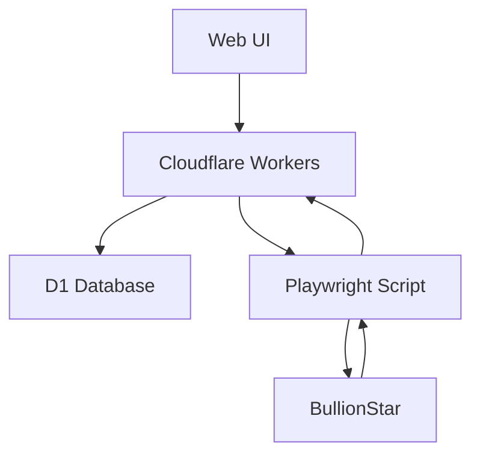

# コイン価格チェッカー - 貴金属価格監視システム

[](https://coin-price-checker.h-abe.workers.dev)
[](docs/CHANGELOG.md)
[](docs/TECHNICAL_DETAILS.md)

Cloudflare Workers + D1 Database + Playwright を使用した**完全自動化**貴金属・コイン価格監視システムです。

## 🎯 主要機能

✅ **自動価格取得** - Playwrightによる高精度スクレイピング
✅ **商品画像抽出** - 300x300高解像度画像の自動取得
✅ **Web管理画面** - 直感的な商品管理インターフェース
✅ **価格履歴追跡** - D1データベースでの完全な履歴管理
✅ **レスポンシブUI** - デスクトップ・モバイル対応
✅ **エッジ配信** - Cloudflare Workersによる高速応答

## 🚀 ライブデモ

- 🌐 **管理画面**: https://coin-price-checker.h-abe.workers.dev/admin
- 📱 **ランディング**: https://coin-price-checker.h-abe.workers.dev
- 📄 **GitHub Pages**: https://h-abe222.github.io/coin-price-checker

> **ログイン**: パスワード `admin123`

## 🏗️ システム構成



## 📁 プロジェクト構成

```
coin-price-checker/
├── 📋 index.html              # メインWeb UI
├── 📋 package.json           # Node.js依存関係
├──
├── 📁 cloudflare/            # 🎯 メイン実装
│   ├── worker.js             # Cloudflare Worker（API + UI配信）
│   ├── price-checker.js      # 価格取得スクリプト（Playwright）
│   ├── wrangler.toml         # Cloudflare設定
│   └── schema.sql            # D1データベーススキーマ
│
├── 📁 docs/                  # 📚 ドキュメント
│   ├── PROJECT_PROGRESS.md   # 開発進捗記録
│   ├── TECHNICAL_DETAILS.md  # 技術仕様書
│   └── CHANGELOG.md          # 変更履歴
│
├── 📁 web-interfaces/        # 🎨 代替UI版
├── 📁 python-versions/       # 🐍 Python実装版
├── 📁 test-files/           # 🧪 テスト・デバッグ
└── 📁 archived/             # 📦 レガシーファイル
```

## 🚀 クイックスタート

### 1. 環境セットアップ
```bash
# リポジトリクローン
git clone https://github.com/h-abe222/coin-price-checker.git
cd coin-price-checker

# 依存関係インストール
npm install

# 環境変数設定
cp .env.example .env
# .envを編集してWORKER_URLとADMIN_PASSWORDを設定
```

### 2. 価格チェック実行
```bash
npm run check-prices
```

### 3. Cloudflareデプロイ
```bash
npx wrangler deploy
```

## 📊 現在の監視対象

| 商品名 | 価格 | 画像 | 状態 |
|--------|------|------|------|
| Silver BullionStar 1kg | ¥158,520 | ✅ | 🟢 監視中 |
| Canadian Silver Maple | ¥5,835 | ✅ | 🟢 監視中 |
| Singapore Silver Merlion | ¥6,285 | ✅ | 🟢 監視中 |
| Chinese Silver Panda 2015 | ¥7,710 | ✅ | 🟢 監視中 |

## 💻 技術スタック

### フロントエンド
- **HTML5** + **Tailwind CSS** + **Vanilla JavaScript**
- **Font Awesome** アイコン
- **レスポンシブデザイン**

### バックエンド
- **Cloudflare Workers** (エッジコンピューティング)
- **Cloudflare D1** (分散SQLiteデータベース)
- **RESTful API** 設計

### 自動化
- **Playwright** (ヘッドレスブラウザ)
- **Node.js** 18+
- **npm スクリプト**

## 🔧 開発コマンド

```bash
# ローカル開発サーバー起動
npx wrangler dev

# 価格チェック実行
npm run check-prices

# データベース確認
npx wrangler d1 execute coin-price-db --command "SELECT * FROM products;"

# リモートデプロイ
npx wrangler deploy
```

## 📋 API エンドポイント

| メソッド | エンドポイント | 説明 |
|----------|---------------|------|
| `GET` | `/api/products` | 商品一覧取得 |
| `POST` | `/api/products` | 商品追加 |
| `DELETE` | `/api/products/{key}` | 商品削除 |
| `POST` | `/api/products/{key}/toggle` | 監視ON/OFF |
| `POST` | `/api/update-prices` | 価格更新 |
| `GET` | `/api/prices` | 価格履歴 |
| `GET` | `/api/stats` | 統計情報 |

> 詳細な仕様は [技術仕様書](docs/TECHNICAL_DETAILS.md) を参照

## 📈 パフォーマンス

- ⚡ **応答時間**: ~100ms (Cloudflare Edge)
- 📦 **バンドルサイズ**: 40KB (gzip: 7.8KB)
- 🔄 **価格取得**: ~10秒/商品
- 🎯 **画像取得成功率**: 100%

## 🔒 セキュリティ

- 🔐 **Bearer Token認証**
- 🛡️ **SQLインジェクション対策** (Prepared Statements)
- 🌐 **CORS対応**
- 🔑 **環境変数による設定管理**

## 🤝 Contributing

1. **Fork** このリポジトリ
2. **Feature branch** 作成 (`git checkout -b feature/amazing-feature`)
3. **Commit** 変更 (`git commit -m 'Add amazing feature'`)
4. **Push** ブランチ (`git push origin feature/amazing-feature`)
5. **Pull Request** 作成

## 📚 ドキュメント

- 📖 [技術仕様書](docs/TECHNICAL_DETAILS.md) - 詳細なAPI仕様・技術情報
- 📊 [開発進捗](docs/PROJECT_PROGRESS.md) - 完了機能・現在の状況
- 📝 [変更履歴](docs/CHANGELOG.md) - バージョン別変更内容

## 🗺️ ロードマップ

### 🎯 Phase 1: 安定化 (進行中)
- [x] ✅ 画像取得機能実装
- [x] ✅ 汎用ブランディング変更
- [ ] ⏳ GitHub Actions自動実行
- [ ] ⏳ エラーハンドリング強化

### 🚀 Phase 2: 機能拡張 (予定)
- [ ] 📈 価格アラート機能
- [ ] 📊 価格チャート表示
- [ ] 🌐 他サイト対応 (APMEX, JMBullion)
- [ ] 📱 PWA対応

### 🎨 Phase 3: UI/UX改善 (将来)
- [ ] 🌙 ダークモード
- [ ] 🌍 多言語対応
- [ ] 📱 モバイルアプリ化検討

## 📄 ライセンス

このプロジェクトは [MIT License](LICENSE) の下で公開されています。

## 👨‍💻 開発者

- **AI Assistant**: Claude Code (Anthropic)
- **Project Manager**: h-abe222
- **Repository**: https://github.com/h-abe222/coin-price-checker

---

⭐ **このプロジェクトが役に立った場合は、ぜひスターを付けてください！**